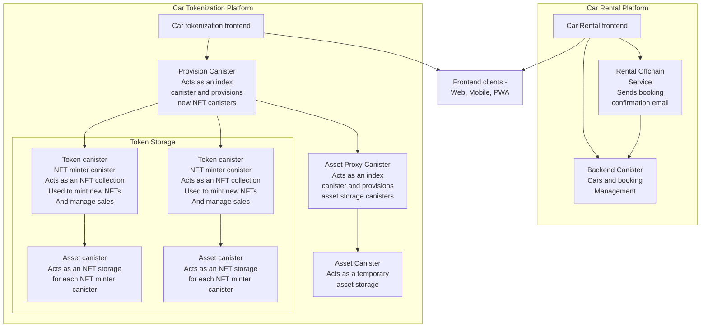

# Car Rental & Tokenization Platforms

This project is a decentralized application (dApp) for car rental management and tokenization, leveraging Internet Computer (ICP) canisters for backend functionality. It includes:

1. **Car Rental Platform** for managing car rentals and bookings.
2. **Car Tokenization Platform** for tokenizing cars as NFTs (Non-Fungible Tokens).

## Canisters Overview

### 1. Car Rental Platform Canister

| **Name**   | **Package** | **Type** | **Description**                      |
|------------|-------------|----------|--------------------------------------|
| **backend** | `backend`  | Rust     | Manages cars and booking operations. |

### 2. Car Tokenization Platform Canisters

| **Name**       | **Package**     | **Type**    | **Description**                                                        |
|----------------|-----------------|-------------|------------------------------------------------------------------------|
| **provision**  | `provision`     | Rust        | Acts as an index canister and provisions new NFT canisters.            |
| **asset_proxy**| `asset_proxy`   | Rust        | Acts as an index canister and provisions asset storage canisters.      |
| **asset**      | Custom          | Wasm Module | Stores assets temporarily for token canisters.                         |
| **token**      | `token`         | Rust        | NFT minter canister, manages NFT collections, minting, and sales.      |

# Architecture Diagram



# Deploying Canisters

## Local Deployment

To deploy the canisters locally using the DFX (Dfinity SDK), run the following script:

```bash
dfx start --background
./scripts/local_deploy.sh
```